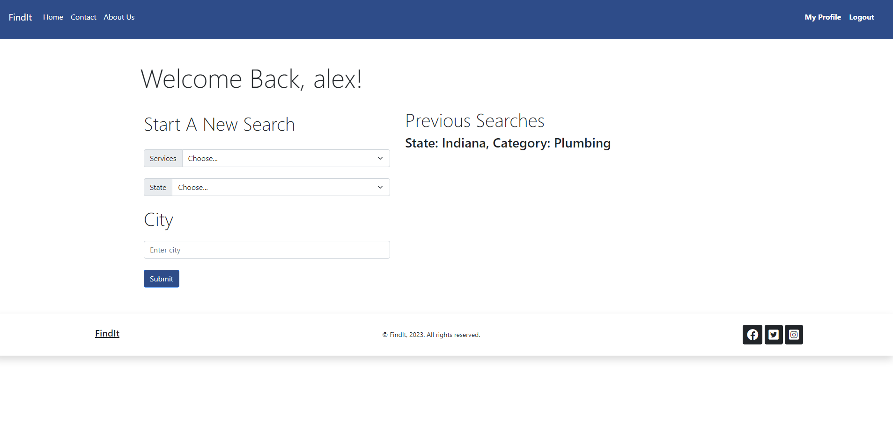

# FindIt
# Project Two – Group Four
# By: 
- Samantha Gard
- Candace Gostinski
- Alex Stock
- Caine Winters

## Description
A site designed to help customers find nearby companies to help with home services they need. 

## New Technology Used
Mocha

## Usage
Our Project is designed to be used by customers looking for home service professionals to connect with for 
services that they need. 

### Screenshots of FindIt application 

## Links
### [Link to GitHub repo](https://github.com/elcaine/FindIt)
### [Link to deployed Heroku app](https://find-it-p2-c5abd3d95f03.herokuapp.com/)

### Acknowledged sources
- Starting point taken from previous assignments.
